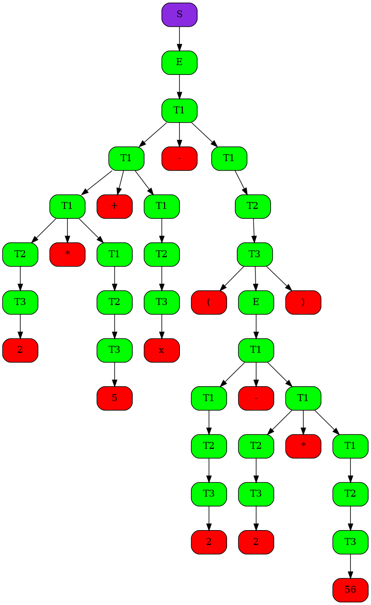

# Визуализация синтаксического анализа для LR0 грамматики

В рамках задания был реализован синтаксический анализ "арифметического" языка с визуализацией процесса построения синтаксического дерева для грамматики LR0. Реализовывать алгоритм получения автомата в общем случае было не нужно, в коде таблицы Actions и GoTo хардкодятся при инициализации парсера. 

Формальное описание грамматики арифметического языка для LR0 парсера:
~~~
S := E

E := T1 + E
E := T1 - E
E := T1

T1 := T2 * T1
T1 := T2 / T1
T1 := T2

T2 := - T3
T2 := T3

T3 := Number
T3 := Variable
T3 := (E)
~~~

Для этого языка автомат и таблицы имеют вид

Автомат

Actions и GoTo

Данная реализация создает pdf файл с таблицей парсинга на каждом шаге, для примера из test.txt получается следующая таблица

| Number |  Stack  |  Symbols  | Input  | Acts  |
|--------|---------|-----------|--------|-------|
|0|0 8 |2 |* 5 + x - ( 2 - 2 * 56 ) $ |Shift 8
|1|0 10 |T3 |* 5 + x - ( 2 - 2 * 56 ) $ |Reduce
|2|0 4 |T2 |* 5 + x - ( 2 - 2 * 56 ) $ |Reduce
|3|0 4 5 |T2 * |5 + x - ( 2 - 2 * 56 ) $ |Shift 5
|4|0 4 5 8 |T2 * 5 |+ x - ( 2 - 2 * 56 ) $ |Shift 8
|5|0 4 5 10 |T2 * T3 |+ x - ( 2 - 2 * 56 ) $ |Reduce
|6|0 4 5 4 |T2 * T2 |+ x - ( 2 - 2 * 56 ) $ |Reduce
|7|0 4 5 12 |T2 * T1 |+ x - ( 2 - 2 * 56 ) $ |Reduce
|8|0 2 |T1 |+ x - ( 2 - 2 * 56 ) $ |Reduce
|9|0 2 5 |T1 + |x - ( 2 - 2 * 56 ) $ |Shift 5
|10|0 2 5 8 |T1 + x |- ( 2 - 2 * 56 ) $ |Shift 8
|11|0 2 5 10 |T1 + T3 |- ( 2 - 2 * 56 ) $ |Reduce
|12|0 2 5 4 |T1 + T2 |- ( 2 - 2 * 56 ) $ |Reduce
|13|0 2 5 12 |T1 + T1 |- ( 2 - 2 * 56 ) $ |Reduce
|14|0 2 |T1 |- ( 2 - 2 * 56 ) $ |Reduce
|15|0 2 5 |T1 - |( 2 - 2 * 56 ) $ |Shift 5
|16|0 2 5 9 |T1 - ( |2 - 2 * 56 ) $ |Shift 9
|17|0 2 5 9 8 |T1 - ( 2 |- 2 * 56 ) $ |Shift 8
|18|0 2 5 9 10 |T1 - ( T3 |- 2 * 56 ) $ |Reduce
|19|0 2 5 9 4 |T1 - ( T2 |- 2 * 56 ) $ |Reduce
|20|0 2 5 9 2 |T1 - ( T1 |- 2 * 56 ) $ |Reduce
|21|0 2 5 9 2 5 |T1 - ( T1 - |2 * 56 ) $ |Shift 5
|22|0 2 5 9 2 5 8 |T1 - ( T1 - 2 |* 56 ) $ |Shift 8
|23|0 2 5 9 2 5 10 |T1 - ( T1 - T3 |* 56 ) $ |Reduce
|24|0 2 5 9 2 5 4 |T1 - ( T1 - T2 |* 56 ) $ |Reduce
|25|0 2 5 9 2 5 4 5 |T1 - ( T1 - T2 * |56 ) $ |Shift 5
|26|0 2 5 9 2 5 4 5 8 |T1 - ( T1 - T2 * 56 |) $ |Shift 8
|27|0 2 5 9 2 5 4 5 10 |T1 - ( T1 - T2 * T3 |) $ |Reduce
|28|0 2 5 9 2 5 4 5 4 |T1 - ( T1 - T2 * T2 |) $ |Reduce
|29|0 2 5 9 2 5 4 5 12 |T1 - ( T1 - T2 * T1 |) $ |Reduce
|30|0 2 5 9 2 5 12 |T1 - ( T1 - T1 |) $ |Reduce
|31|0 2 5 9 2 |T1 - ( T1 |) $ |Reduce
|32|0 2 5 9 13 |T1 - ( E |) $ |Reduce
|33|0 2 5 9 13 14 |T1 - ( E ) |$ |Shift 14
|34|0 2 5 10 |T1 - T3 |$ |Reduce
|35|0 2 5 4 |T1 - T2 |$ |Reduce
|36|0 2 5 12 |T1 - T1 |$ |Reduce
|37|0 2 |T1 |$ |Reduce
|38|0 1 |E |$ |Reduce
|39|0 1 |S |$ |Accept

Также создается картинка с итоговым деревом:

Синтаксическое дерево

